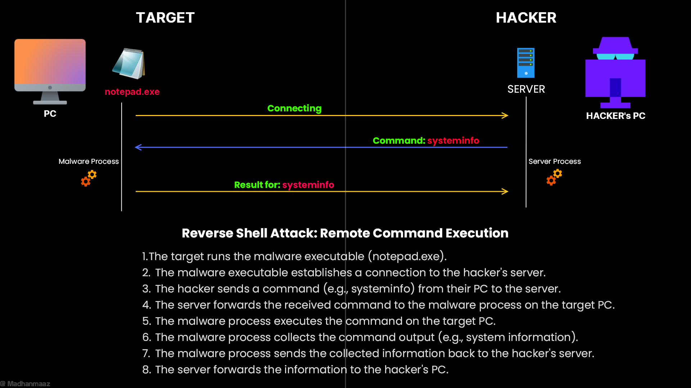

# Reverse shell with netcat listener

## More
- Video [Youtube](https://youtu.be/jfrRGfnhTPQ)
- Blog [Medium](https://medium.com/@madhanmaaz/remote-access-made-simple-for-hackers-go-reverse-shell-tutorial-0ae7b38615b5)

# Languages
- Go

# Map

