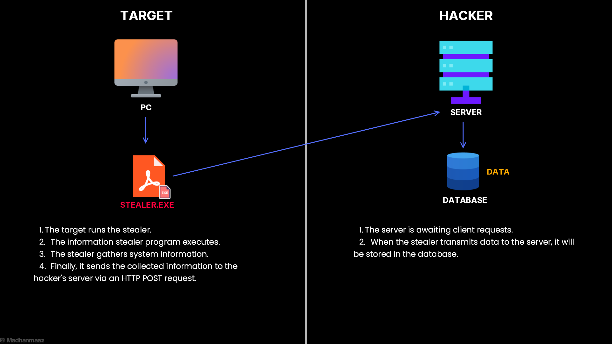

# Simple Information Stealer in Python with Flask Server


- An information stealer typically captures sensitive information from a user's device and sends it to a remote server. This example demonstrates how an attacker might set up a basic information stealer using Python and a Flask server.

## More
- Video [Youtube](https://youtu.be/wN7IpqNUyeY?si=ORGPitiy0pR6fiY)
- Blog [Medium](https://madhanmaaz.medium.com/understanding-information-stealers-how-they-work-and-how-to-defend-against-them-362da82990e3)

# Languages
- Python
    - Flask framework.

# Map


# Setup
#### For windows
```bash
.\build.bat
```
#### For linux
```bash
.\build.sh
```
